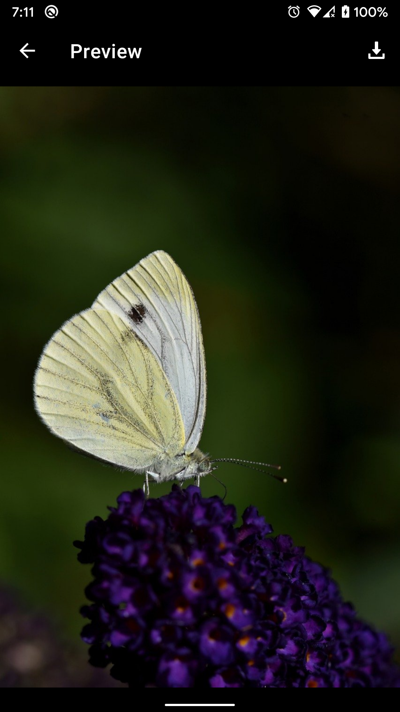
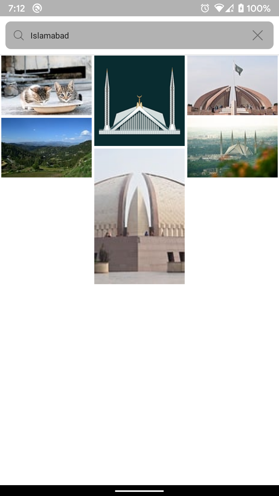
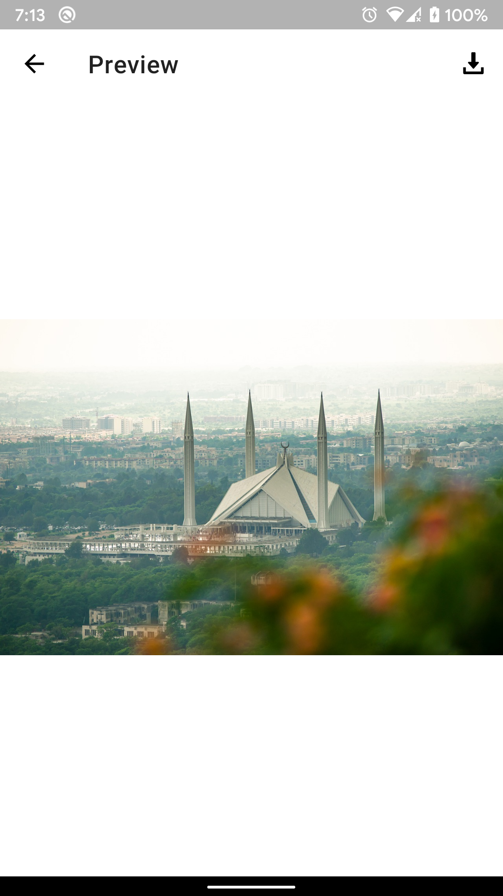

# Gallery

   

## Implementation Details

Following are the features implemented;
1. The user can view the list of, search for and preview images from [Pixabay API](https://pixabay.com/api/docs/).
2. Images can be downloaded using DownloadManager. Right now image in "largeImageURL" is being downloaded as I didn't receive "imageURL" param in JSON despite filling the application description form a day or 2 ago.  
3. And **Retrofit** is used to fetch the data from the api which is then paginated using **Paging 3** with **Coroutine Flows**.
4. All the project dependencies are injected using **Hilt**
5. **Dark Theme** support for Android 10 and above
6. All the presentation is done using **Android Architecture Components** like ViewModels, LiveData and Data Binding.

## Project Setup
1. Clone the project and run it in Android studio.
2. Go to Pixabay developer page and generate an API key.
3. Copy the generated API key from your account details page.
4. Store the copied API key in your computers Environment Variables by name: __ImageApiKey__
5. You will also have to store the API base url in your computers Environment Variables by name: __ImageApiBaseUrl__
5. Build and Run the application \m/.